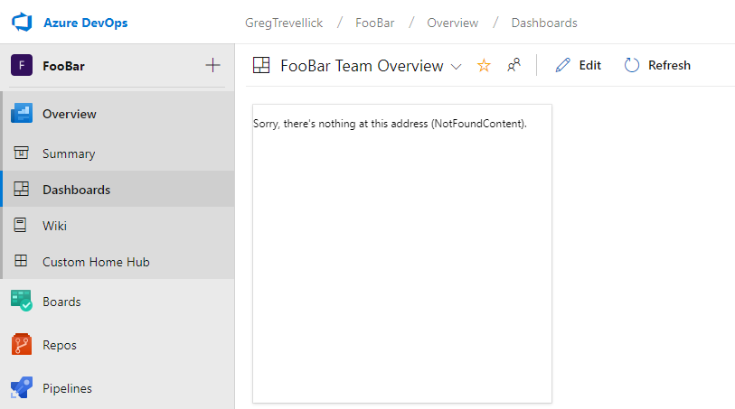

# Blazor routing fails in Azure DevOps iframe

I have a simple [Blazor](https://dotnet.microsoft.com/apps/aspnet/web-apps/client) website ([source code](https://github.com/GregTrevellick/BlazorVsixStackOverflowQuestion)) which has a routing issue when running in an iframe on [Azure Devops](https://azure.microsoft.com/en-gb/services/devops/) but not elsewhere.

The application works fine when running under the following conditions

 - locally on my PC using Visual Studio (VS2019) using 'F5'
 - locally as a static site after having published the project to disc using the Visual Studio 'Publish' function
 - locally as a static site within an iframe of another unrelated site
 - remotely as a hosted static site after uploading the published site to a host
 - remotely as a static site within an iframe of another unrelated site (this second static site mimics AzureDevOps boards, using a different host name)
 
 However when I generate an [Azure Devops widget](https://docs.microsoft.com/en-us/azure/devops/extend/develop/add-dashboard-widget?view=azure-devops) and upload it to the [Visual Studio Marketplace](https://marketplace.visualstudio.com/items?itemName=GregTrevellick.BlazorWidget) Blazor routing fails and therefore the site fails to load correctly, as per this screenshot.
 
 

 The source code for the site (which nothing more than a simplified version of the default VS Blazor template) can be found [here](https://github.com/GregTrevellick/BlazorVsixStackOverflowQuestion).

 Observations
 
 - all the blazor-related assets (i.e. Blazor & mono javascript files & various DLL files) are served up to the browser successfully
 - the blazor DLL runs successfully (i.e. ```Programs.cs``` kicks in successfully - ```Console.WriteLine``` statements in ```Program.cs``` and ```StartUp.cs``` prove this)
 - blazor fails to successfully find the default route and hence the ```<NotFoundContent>``` (defined in  ```App.razor```) tag is displayed within the [Azure Devops iframe](https://marketplace.visualstudio.com/items?itemName=GregTrevellick.BlazorWidget)
 
 Things I have tried to solve the issue
 
 - define the ```base href``` as "/" in ```wwwroot\index.html```
 - define the ```base href``` as "/dist" in ```wwwroot\index.html```
 - define the route in an ```index.cs``` file using a ```[Route]``` attribute
 - dynamic define the ```base href``` in ```wwwroot\index.html``` at runtime using javascript (this caters for any changes to the iframe parent URL by Microsoft)

 Notes

 - all [Azure Devops widgets](https://marketplace.visualstudio.com/search?target=AzureDevOps&category=Azure%20Boards&sortBy=Downloads) run inside an iframe within [Azure Devops](https://azure.microsoft.com/en-gb/services/devops/).
 - the vsix file that was uploaded to Visual Studio Marketplace [can be found here](https://github.com/GregTrevellick/BlazorVsixStackOverflowQuestion/blob/master/Src/BlazorVsixStackOverflowQuestion/bin/Debug/netstandard2.0/publish/GregTrevellick.BlazorWidget-1.0.11.vsix).